# PlantPOS - Plant Store Management System

A comprehensive Point of Sale (POS) system designed specifically for plant stores, featuring modern desktop application with AI integration for plant care consultation.

## 🎬 Demo Video

[](https://www.youtube.com/watch?v=oViAZzM5dco)

## 🏗️ Project Structure

```
csc13001-plant-pos/
├── backend/                    # Spring Boot API Server
│   ├── src/main/java/         # Java source code
│   └── docker-compose.yml     # Database & MinIO setup
├── frontend/                  # WinUI3 Desktop Application
│   └── csc13001-plant-pos/   # Main frontend project
├── docs/                     # Documentation & Screenshots
└── README.md
```

## 🛠️ Tech Stack

### Backend

- **Java 17** + **Spring Boot** - RESTful API server
- **MySQL** - Primary database
- **Redis** - Caching layer
- **MinIO** - Object storage for images
- **Docker** - Containerization
- **Swagger UI** - API documentation

### Frontend

- **C#** + **WinUI 3** - Modern Windows desktop app
- **MVVM Pattern** - Clean architecture
- **Dependency Injection** - Service management

### External Services

- **Gemini AI** - Plant care chatbot
- **Email Service** - Daily reports and notifications

### Prerequisites

- **Java 17+**
- **Maven**
- **Docker & Docker Compose**
- **.NET 8 SDK**
- **Visual Studio** (with WinUI workload)

### 1. Clone Repository

```bash
git clone https://github.com/Npeka/csc13001-plant-pos.git
cd csc13001-plant-pos
```

### 2. Configure Backend

Create your application.properties file from the template:

```bash
cd backend/src/main/resources
cp application.properties.template application.properties
```

Edit `application.properties` and replace the following placeholders:

- `YOUR_JWT_SECRET_KEY_HERE` - Generate a secure JWT secret key
- `YOUR_EMAIL@gmail.com` - Your Gmail address for notifications
- `YOUR_EMAIL_APP_PASSWORD` - Gmail app password (not your regular password)
- `YOUR_GEMINI_API_KEY_HERE` - Your Google Gemini API key

**How to get required API keys:**

1. **Gmail App Password**: Go to Google Account Settings → Security → 2-Step Verification → App passwords
2. **Gemini API Key**: Visit [Google AI Studio](https://makersuite.google.com/app/apikey) to generate your key

### 3. Configure Frontend

Create your appsettings.json file from the template:

```bash
cd frontend/csc13001-plant-pos/csc13001-plant-pos
cp appsettings.template.json appsettings.json
```

Edit `appsettings.json` and replace the following placeholders:

- `YOUR_EMAIL@gmail.com` - Your Gmail address for notifications
- `YOUR_EMAIL_APP_PASSWORD` - Gmail app password (same as backend)
- `YOUR_SYNCFUSION_LICENSE_KEY` - Your Syncfusion license key (optional, for UI components)
- `YOUR_ENCRYPTION_KEY_HERE` - Custom encryption key for secure data storage

### 4. Start Backend Services

```bash
cd backend
docker-compose up -d
mvn spring-boot:run
```

### 5. Run Frontend Application

```bash
cd csc13001-plant-pos-frontend
dotnet restore
# Open in Visual Studio and run (F5)
```

### 6. Access Services

- **Application**: Run from Visual Studio
- **API Documentation**: http://localhost:8080/swagger-ui/index.html
- **MinIO Console**: http://localhost:9001 (plantpos/plantpos)
- **Database**: localhost:33306 (plantpos/plantpos)

## ⚠️ Important Notes

- Never commit your actual configuration files (`application.properties`, `appsettings.json`) with real credentials
- Template files mask sensitive information for security
- Both configuration files are already added to `.gitignore`
- Use environment variables in production for better security
- **Syncfusion License**: You can get a free community license from [Syncfusion](https://www.syncfusion.com/products/communitylicense) if needed

## 📱 Features & Screenshots

### Authentication & User Management

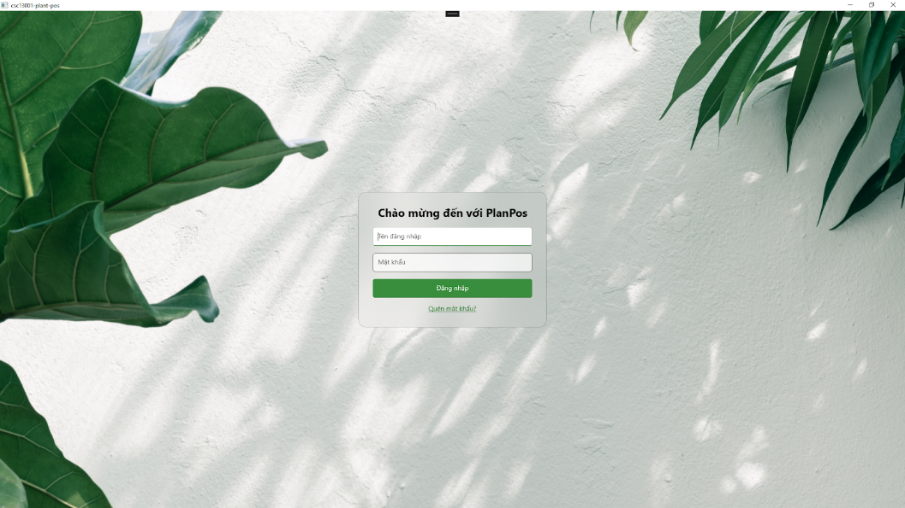

- Secure login with credential storage
- OTP-based password recovery
- Role-based access control (Admin/Staff)

### Sales Management

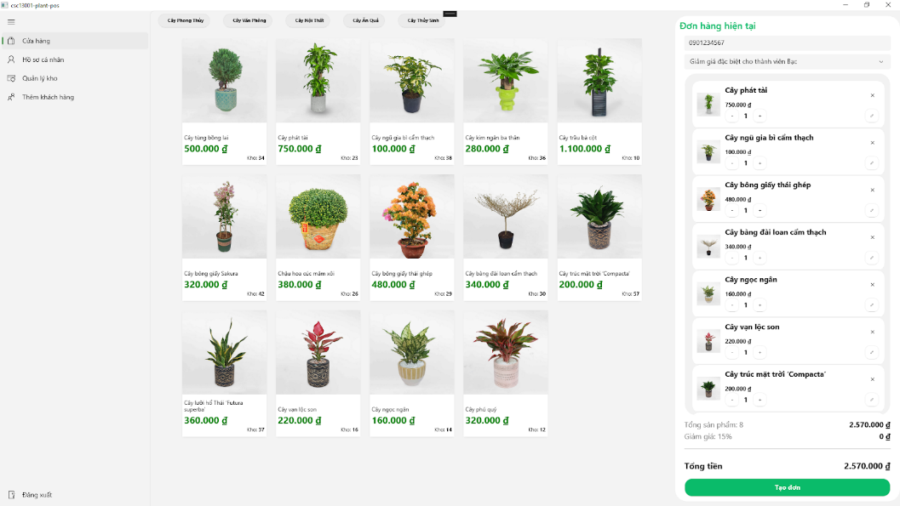

- Product selection and quantity management
- Customer membership integration
- Real-time discount application
- PDF invoice generation

### Admin Dashboard

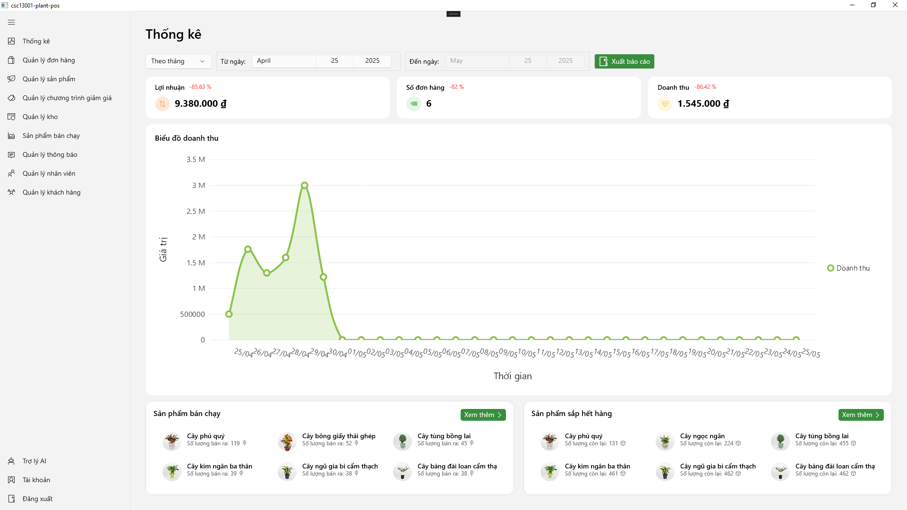

- Revenue analytics with charts
- Top-selling products tracking
- Inventory alerts
- Excel report exports

### Product Management

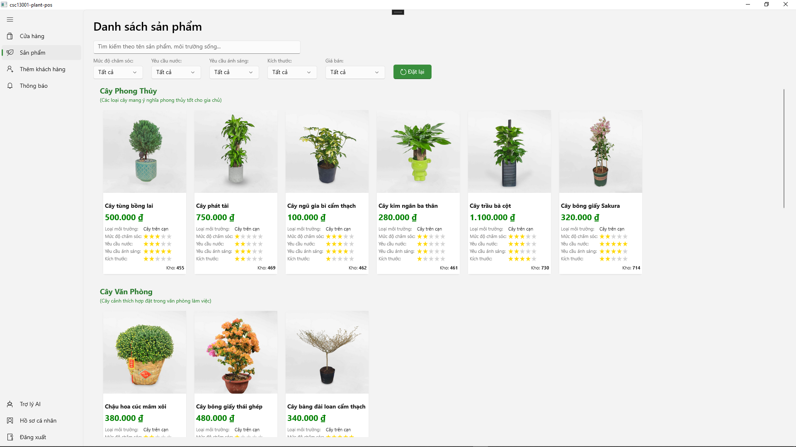

- Comprehensive product catalog
- Advanced search and filtering
- Category management
- Stock level monitoring

### Customer Management

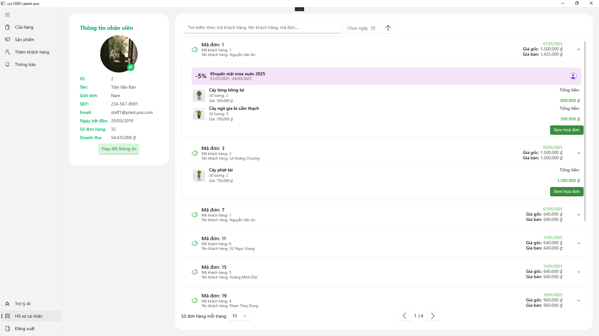

- Member registration and profiles
- Purchase history tracking
- Loyalty program integration

### Order Management

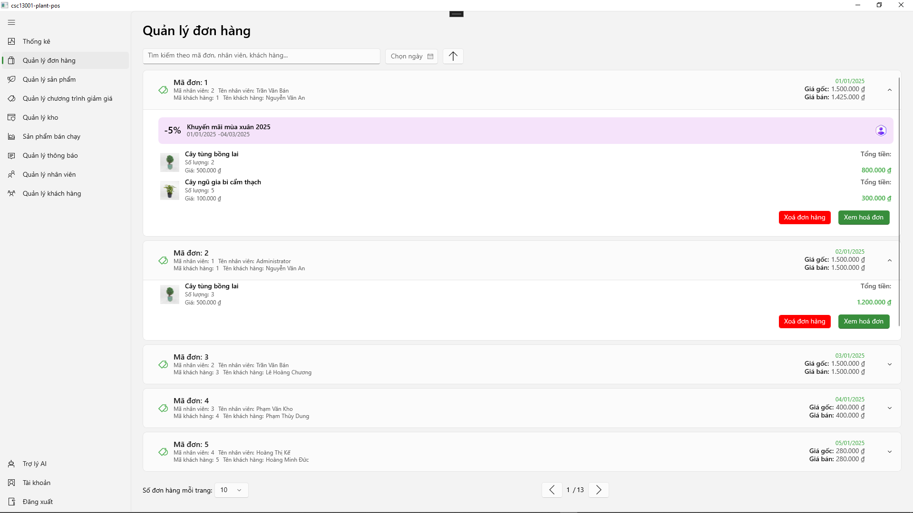

- Complete order tracking
- Transaction history
- Payment processing

### AI Chat Assistant

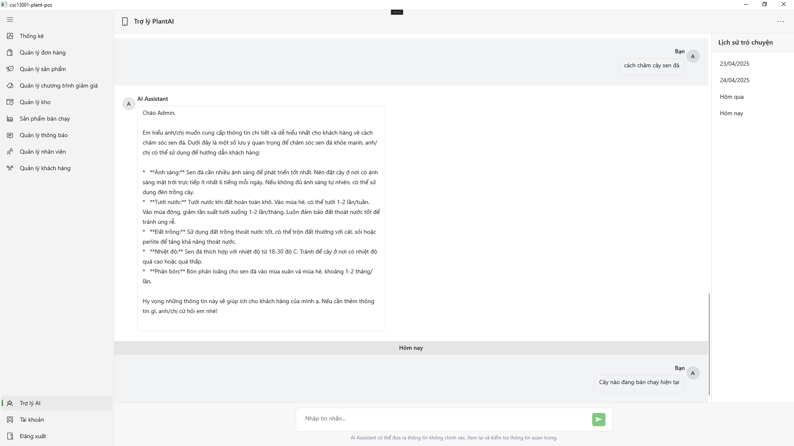

- Plant care consultation
- Product recommendations
- Business insights
- Multi-language support

### Invoice System

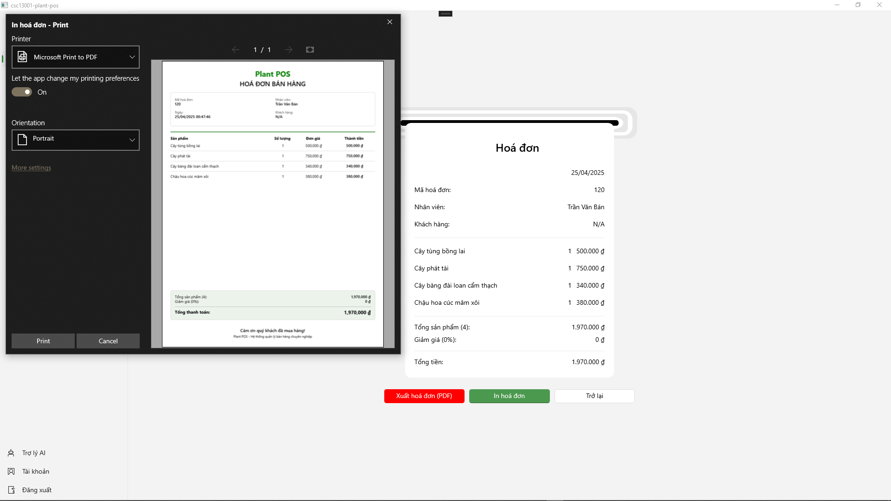

- Professional invoice templates
- PDF export functionality
- Print integration
- Transaction records

### Email Notifications

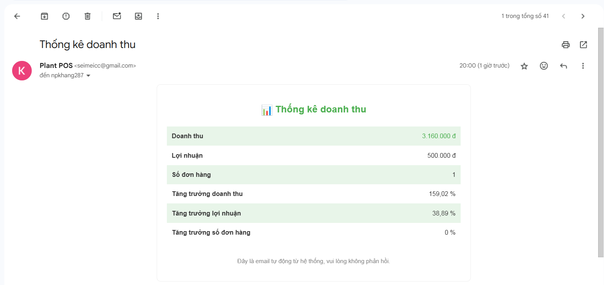

- Automated daily reports
- Inventory alerts
- Customer notifications

## 🏛️ System Architecture

### Database Schema

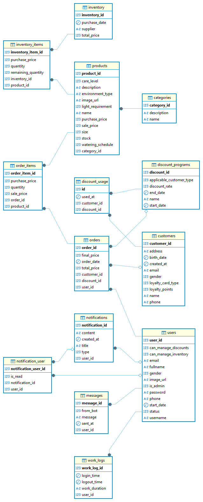

### Component Architecture

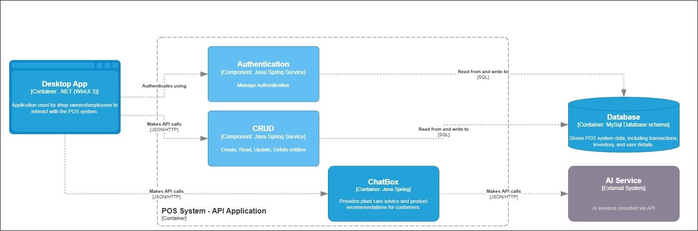

The system follows a clean architecture pattern with:

- **Frontend**: WinUI3 with MVVM pattern
- **Backend**: Spring Boot with layered architecture
- **Database**: MySQL with optimized schemas
- **Storage**: MinIO for scalable file management
- **Cache**: Redis for performance optimization
